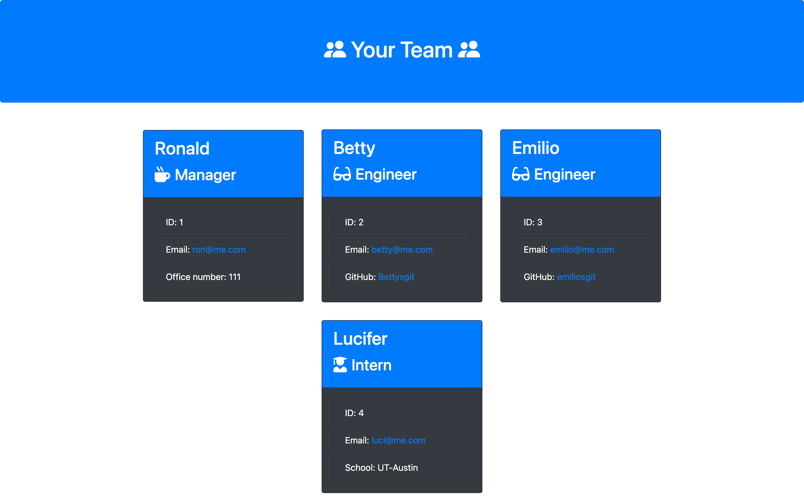

# Team Profile Generator

## Description
The goal of this project was to create an application using Node.js command-lineto take in information about employees on a software engineering team, then generate an HTML webpage that displays summaries for each person. This application is an inroduction to how object-oriented programming could help with various relateable data and easily scales with more data.

## Table of Contents
- [Installation](#installation)
- [Usage](#usage)
- [Credits](#credits)
- [License](#license)
- [Tests](#tests)
- [Qustions](#questions)
- [Github-app](#github-app)

## Installation
Node.js, NPM Inquirer were used to gather data

## Usage
[Video Usage of Application](https://watch.screencastify.com/v/ZbY6wTlxApRhuGSavOnE)

[Same video... different link](https://drive.google.com/file/d/1qP7y4GEGYeXRTKmlV1-tECRU9paRT_EM/view)

## Credits
Collaborators that helped with this project: My tutor, Jacob, and my classmates, Damien and Emilio

## License
This project is covered under an MIT license. More information can be found here: https://opensource.org/licenses/MIT

## Tests
[Jest](https://jestjs.io/)

## Questions
If you have any questions, feel free to email <mrronsit@gmail.com> or feel free to peruse my [Github](https://github.com/Sitmeister)!

## Github-app
[Application in Github](https://github.com/sitmeister/HW10_Team_Profile_Generator)
